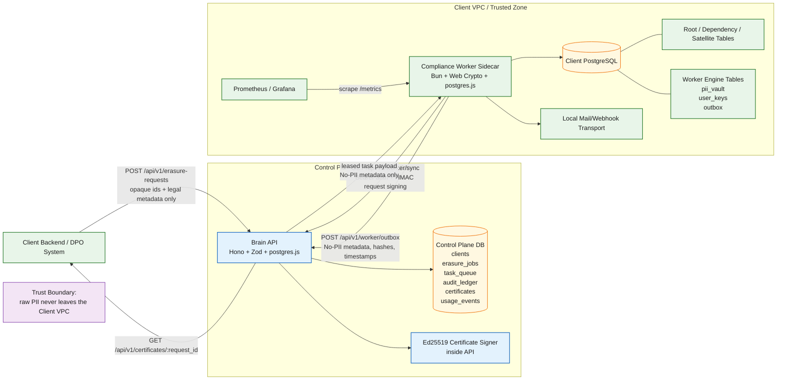

# System Context

```mermaid
flowchart LR
    classDef trusted fill:#e8f5e9,stroke:#2e7d32,stroke-width:1.5px,color:#1b1b1b;
    classDef control fill:#e3f2fd,stroke:#1565c0,stroke-width:1.5px,color:#1b1b1b;
    classDef db fill:#fff8e1,stroke:#ef6c00,stroke-width:1.2px,color:#1b1b1b;
    classDef note fill:#f3e5f5,stroke:#6a1b9a,stroke-width:1px,color:#1b1b1b;

    Client[Client Backend / DPO System]

    subgraph SaaS[Control Plane / External SaaS Zone]
        API[Brain API<br/>Hono + Zod + postgres.js]
        CPDB[(Control Plane DB<br/>clients<br/>erasure_jobs<br/>task_queue<br/>audit_ledger<br/>certificates<br/>usage_events)]
        Signer[Ed25519 Certificate Signer<br/>inside API]

        API --> CPDB
        API --> Signer
    end

    subgraph VPC[Client VPC / Trusted Zone]
        Worker[Compliance Worker Sidecar<br/>Bun + Web Crypto + postgres.js]
        AppDB[(Client PostgreSQL)]
        AppTables[Root / Dependency / Satellite Tables]
        EngineTables[Worker Engine Tables<br/>pii_vault<br/>user_keys<br/>outbox]
        Metrics[Prometheus / Grafana]
        Notice[Local Mail/Webhook Transport]

        Worker --> AppDB
        AppDB --- AppTables
        AppDB --- EngineTables
        Metrics -->|scrape /metrics| Worker
        Worker --> Notice
    end

    Client -->|POST /api/v1/erasure-requests<br/>opaque ids + legal metadata only| API
    Worker -->|GET /api/v1/worker/sync<br/>Bearer auth + HMAC request signing| API
    API -->|leased task payload<br/>No-PII metadata only| Worker
    Worker -->|POST /api/v1/worker/outbox<br/>No-PII metadata, hashes, timestamps| API
    API -->|GET /api/v1/certificates/:request_id| Client

    Boundary[Trust Boundary:<br/>raw PII never leaves the Client VPC]

    class Client trusted
    class Worker,AppDB,AppTables,EngineTables,Metrics,Notice trusted
    class API,CPDB,Signer control
    class AppDB,CPDB db
    class Boundary note
```
