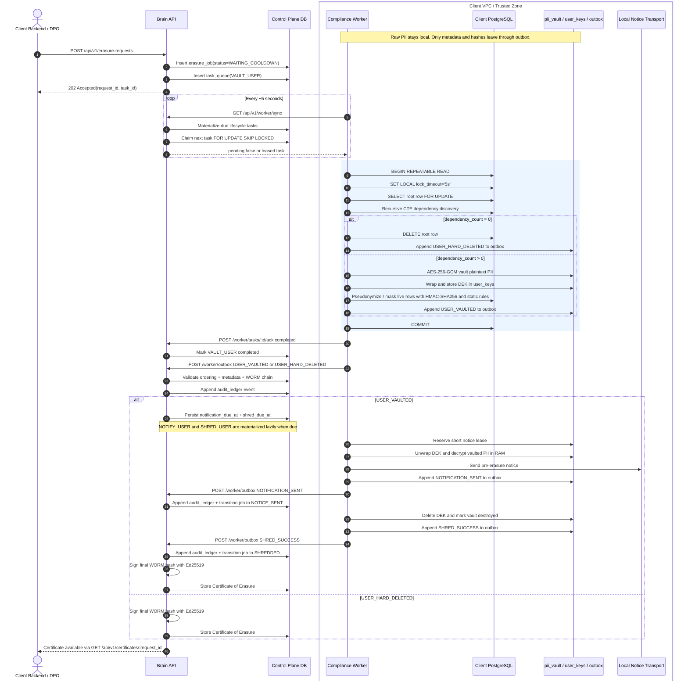

# End-To-End Sequence

```mermaid
sequenceDiagram
    autonumber
    actor Client as Client Backend / DPO
    participant API as Brain API
    participant CPDB as Control Plane DB

    box Client VPC / Trusted Zone
        participant Worker as Compliance Worker
        participant AppDB as Client PostgreSQL
        participant Engine as pii_vault / user_keys / outbox
        participant Mailer as Local Notice Transport
    end

    Note over Worker,Engine: Raw PII stays local. Only metadata and hashes leave through outbox.

    Client->>API: POST /api/v1/erasure-requests
    API->>CPDB: Insert erasure_job(status=WAITING_COOLDOWN)
    API->>CPDB: Insert task_queue(VAULT_USER)
    API-->>Client: 202 Accepted(request_id, task_id)

    loop Every ~5 seconds
        Worker->>API: GET /api/v1/worker/sync
        API->>CPDB: Materialize due lifecycle tasks
        API->>CPDB: Claim next task FOR UPDATE SKIP LOCKED
        API-->>Worker: pending false or leased task
    end

    rect rgb(235,245,255)
        Worker->>AppDB: BEGIN REPEATABLE READ
        Worker->>AppDB: SET LOCAL lock_timeout='5s'
        Worker->>AppDB: SELECT root row FOR UPDATE
        Worker->>AppDB: Recursive CTE dependency discovery
        alt dependency_count = 0
            Worker->>AppDB: DELETE root row
            Worker->>Engine: Append USER_HARD_DELETED to outbox
        else dependency_count > 0
            Worker->>Engine: AES-256-GCM vault plaintext PII
            Worker->>Engine: Wrap and store DEK in user_keys
            Worker->>AppDB: Pseudonymize / mask live rows with HMAC-SHA256 and static rules
            Worker->>Engine: Append USER_VAULTED to outbox
        end
        Worker->>AppDB: COMMIT
    end

    Worker->>API: POST /worker/tasks/:id/ack completed
    API->>CPDB: Mark VAULT_USER completed

    Worker->>API: POST /worker/outbox USER_VAULTED or USER_HARD_DELETED
    API->>CPDB: Validate ordering + metadata + WORM chain
    API->>CPDB: Append audit_ledger event

    alt USER_VAULTED
        API->>CPDB: Persist notification_due_at + shred_due_at
        Note over API,CPDB: NOTIFY_USER and SHRED_USER are materialized lazily when due

        Worker->>Engine: Reserve short notice lease
        Worker->>Engine: Unwrap DEK and decrypt vaulted PII in RAM
        Worker->>Mailer: Send pre-erasure notice
        Worker->>Engine: Append NOTIFICATION_SENT to outbox
        Worker->>API: POST /worker/outbox NOTIFICATION_SENT
        API->>CPDB: Append audit_ledger + transition job to NOTICE_SENT

        Worker->>Engine: Delete DEK and mark vault destroyed
        Worker->>Engine: Append SHRED_SUCCESS to outbox
        Worker->>API: POST /worker/outbox SHRED_SUCCESS
        API->>CPDB: Append audit_ledger + transition job to SHREDDED
        API->>API: Sign final WORM hash with Ed25519
        API->>CPDB: Store Certificate of Erasure
    else USER_HARD_DELETED
        API->>API: Sign final WORM hash with Ed25519
        API->>CPDB: Store Certificate of Erasure
    end

    API-->>Client: Certificate available via GET /api/v1/certificates/:request_id
```
