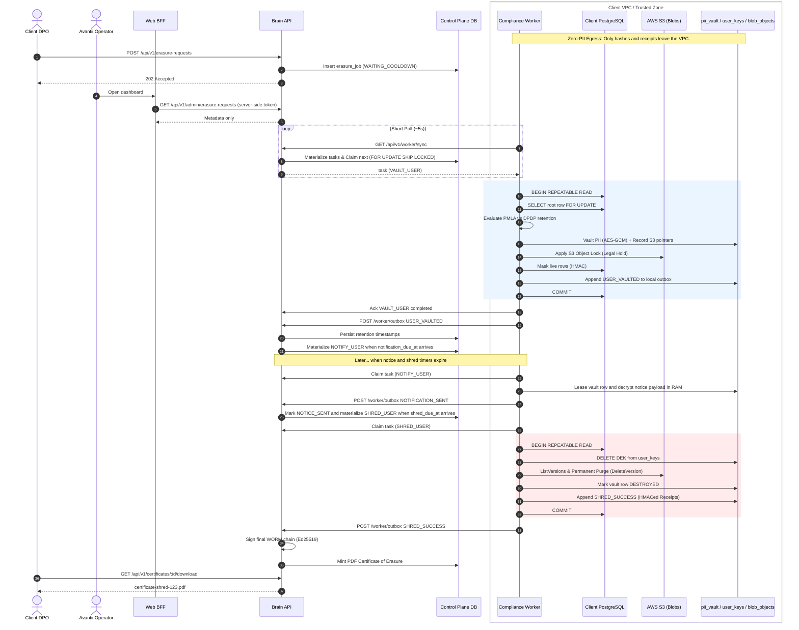

# End-To-End Sequence: Database & Blob Erasure

```mermaid
sequenceDiagram
    autonumber
    actor DPO as Client DPO
    actor Ops as Avantii Operator
    participant Web as Web BFF
    participant API as Brain API
    participant CPDB as Control Plane DB

    box Client VPC / Trusted Zone
        participant Worker as Compliance Worker
        participant AppDB as Client PostgreSQL
        participant S3 as AWS S3 (Blobs)
        participant Engine as pii_vault / user_keys / blob_objects
    end

    Note over Worker,Engine: Zero-PII Egress: Only hashes and receipts leave the VPC.

    DPO->>API: POST /api/v1/erasure-requests
    API->>CPDB: Insert erasure_job (WAITING_COOLDOWN)
    API-->>DPO: 202 Accepted

    Ops->>Web: Open dashboard
    Web->>API: GET /api/v1/admin/erasure-requests (server-side token)
    API-->>Web: Metadata only

    loop Short-Poll (~5s)
        Worker->>API: GET /api/v1/worker/sync
        API->>CPDB: Materialize tasks & Claim next (FOR UPDATE SKIP LOCKED)
        API-->>Worker: task (VAULT_USER)
    end

    rect rgb(235,245,255)
        Worker->>AppDB: BEGIN REPEATABLE READ
        Worker->>AppDB: SELECT root row FOR UPDATE
        Worker->>Worker: Evaluate PMLA vs DPDP retention
        Worker->>Engine: Vault PII (AES-GCM) + Record S3 pointers
        Worker->>S3: Apply S3 Object Lock (Legal Hold)
        Worker->>AppDB: Mask live rows (HMAC)
        Worker->>Engine: Append USER_VAULTED to local outbox
        Worker->>AppDB: COMMIT
    end

    Worker->>API: Ack VAULT_USER completed
    Worker->>API: POST /worker/outbox USER_VAULTED
    API->>CPDB: Persist retention timestamps
    API->>CPDB: Materialize NOTIFY_USER when notification_due_at arrives

    Note over API,Worker: Later... when notice and shred timers expire

    Worker->>API: Claim task (NOTIFY_USER)
    Worker->>Engine: Lease vault row and decrypt notice payload in RAM
    Worker->>API: POST /worker/outbox NOTIFICATION_SENT
    API->>CPDB: Mark NOTICE_SENT and materialize SHRED_USER when shred_due_at arrives

    Worker->>API: Claim task (SHRED_USER)
    
    rect rgb(255,235,235)
        Worker->>AppDB: BEGIN REPEATABLE READ
        Worker->>Engine: DELETE DEK from user_keys
        Worker->>S3: ListVersions & Permanent Purge (DeleteVersion)
        Worker->>Engine: Mark vault row DESTROYED
        Worker->>Engine: Append SHRED_SUCCESS (HMACed Receipts)
        Worker->>AppDB: COMMIT
    end

    Worker->>API: POST /worker/outbox SHRED_SUCCESS
    API->>API: Sign final WORM chain (Ed25519)
    API->>CPDB: Mint PDF Certificate of Erasure
    
    DPO->>API: GET /api/v1/certificates/:id/download
    API-->>DPO: certificate-shred-123.pdf
```
