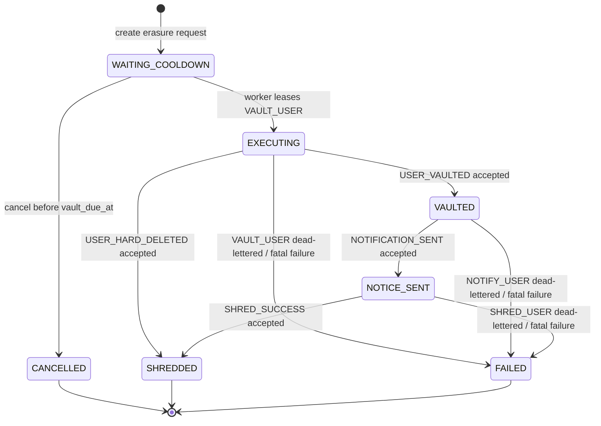
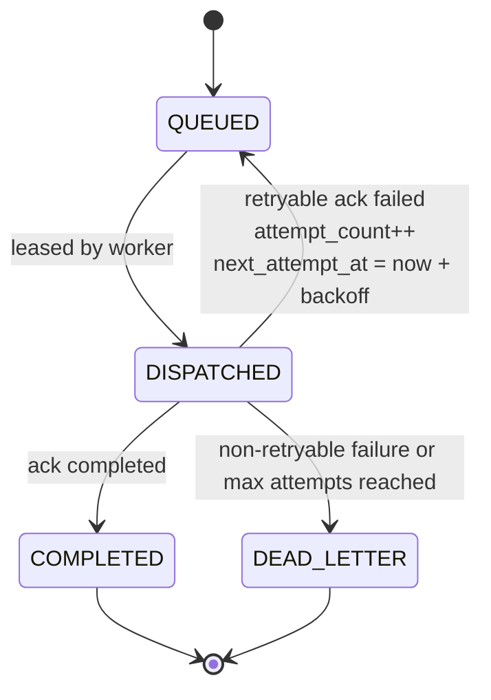

# Control Plane State Machine

```mermaid
stateDiagram-v2
    [*] --> WAITING_COOLDOWN: create erasure request

    WAITING_COOLDOWN --> CANCELLED: cancel before vault_due_at
    WAITING_COOLDOWN --> EXECUTING: worker leases VAULT_USER

    EXECUTING --> VAULTED: USER_VAULTED accepted
    EXECUTING --> SHREDDED: USER_HARD_DELETED accepted
    EXECUTING --> FAILED: VAULT_USER dead-lettered / fatal failure

    VAULTED --> NOTICE_SENT: NOTIFICATION_SENT accepted
    VAULTED --> FAILED: NOTIFY_USER dead-lettered / fatal failure

    NOTICE_SENT --> SHREDDED: SHRED_SUCCESS accepted
    NOTICE_SENT --> FAILED: SHRED_USER dead-lettered / fatal failure

    CANCELLED --> [*]
    SHREDDED --> [*]
    FAILED --> [*]
```

## Task queue lifecycle

```mermaid
stateDiagram-v2
    [*] --> QUEUED
    QUEUED --> DISPATCHED: leased by worker
    DISPATCHED --> COMPLETED: ack completed
    DISPATCHED --> QUEUED: retryable ack failed<br/>attempt_count++<br/>next_attempt_at = now + backoff
    DISPATCHED --> DEAD_LETTER: non-retryable failure or max attempts reached
    COMPLETED --> [*]
    DEAD_LETTER --> [*]
```
