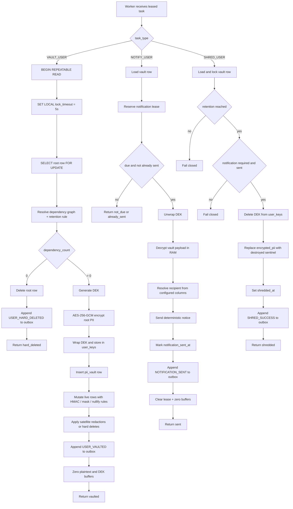

# Worker Execution Branches

```mermaid
flowchart TD
    A[Worker receives leased task] --> B{task_type}

    B -->|VAULT_USER| C[BEGIN REPEATABLE READ]
    C --> D[SET LOCAL lock_timeout = 5s]
    D --> E[SELECT root row FOR UPDATE]
    E --> F[Resolve dependency graph + retention rule]
    F --> G{dependency_count}

    G -->|0| H[Delete root row]
    H --> I[Append USER_HARD_DELETED to outbox]
    I --> J[Return hard_deleted]

    G -->|> 0| K[Generate DEK]
    K --> L[AES-256-GCM encrypt root PII]
    L --> M[Wrap DEK and store in user_keys]
    M --> N[Insert pii_vault row]
    N --> O[Mutate live rows with HMAC / mask / nullify rules]
    O --> P[Apply satellite redactions or hard deletes]
    P --> Q[Append USER_VAULTED to outbox]
    Q --> R[Zero plaintext and DEK buffers]
    R --> S[Return vaulted]

    B -->|NOTIFY_USER| T[Load vault row]
    T --> U[Reserve notification lease]
    U --> V{due and not already sent}
    V -->|no| W[Return not_due or already_sent]
    V -->|yes| X[Unwrap DEK]
    X --> Y[Decrypt vault payload in RAM]
    Y --> Z[Resolve recipient from configured columns]
    Z --> AA[Send deterministic notice]
    AA --> AB[Mark notification_sent_at]
    AB --> AC[Append NOTIFICATION_SENT to outbox]
    AC --> AD[Clear lease + zero buffers]
    AD --> AE[Return sent]

    B -->|SHRED_USER| AF[Load and lock vault row]
    AF --> AG{retention reached}
    AG -->|no| AH[Fail closed]
    AG -->|yes| AI{notification required and sent}
    AI -->|no| AJ[Fail closed]
    AI -->|yes| AK[Delete DEK from user_keys]
    AK --> AL[Replace encrypted_pii with destroyed sentinel]
    AL --> AM[Set shredded_at]
    AM --> AN[Append SHRED_SUCCESS to outbox]
    AN --> AO[Return shredded]
```
