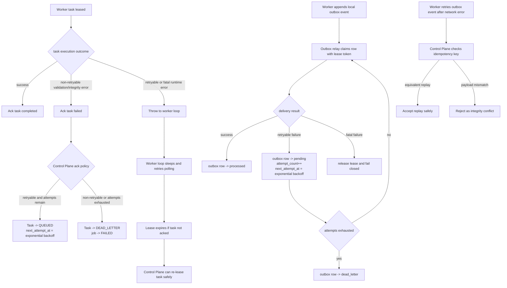

# Fail-Safe And Retry Flows

```mermaid
flowchart TD
    A[Worker task leased] --> B{task execution outcome}

    B -->|success| C[Ack task completed]
    B -->|non-retryable validation/integrity error| D[Ack task failed]
    B -->|retryable or fatal runtime error| E[Throw to worker loop]

    D --> F{Control Plane ack policy}
    F -->|retryable and attempts remain| G[Task -> QUEUED<br/>next_attempt_at = exponential backoff]
    F -->|non-retryable or attempts exhausted| H[Task -> DEAD_LETTER<br/>job -> FAILED]

    E --> I[Worker loop sleeps and retries polling]
    I --> J[Lease expires if task not acked]
    J --> K[Control Plane can re-lease task safely]

    L[Worker appends local outbox event] --> M[Outbox relay claims row with lease token]
    M --> N{delivery result}
    N -->|success| O[outbox row -> processed]
    N -->|retryable failure| P[outbox row -> pending<br/>attempt_count++<br/>next_attempt_at = exponential backoff]
    N -->|fatal failure| Q[release lease and fail closed]
    P --> R{attempts exhausted}
    R -->|yes| S[outbox row -> dead_letter]
    R -->|no| M

    T[Worker retries outbox event after network error] --> U[Control Plane checks idempotency key]
    U -->|equivalent replay| V[Accept replay safely]
    U -->|payload mismatch| W[Reject as integrity conflict]
```
