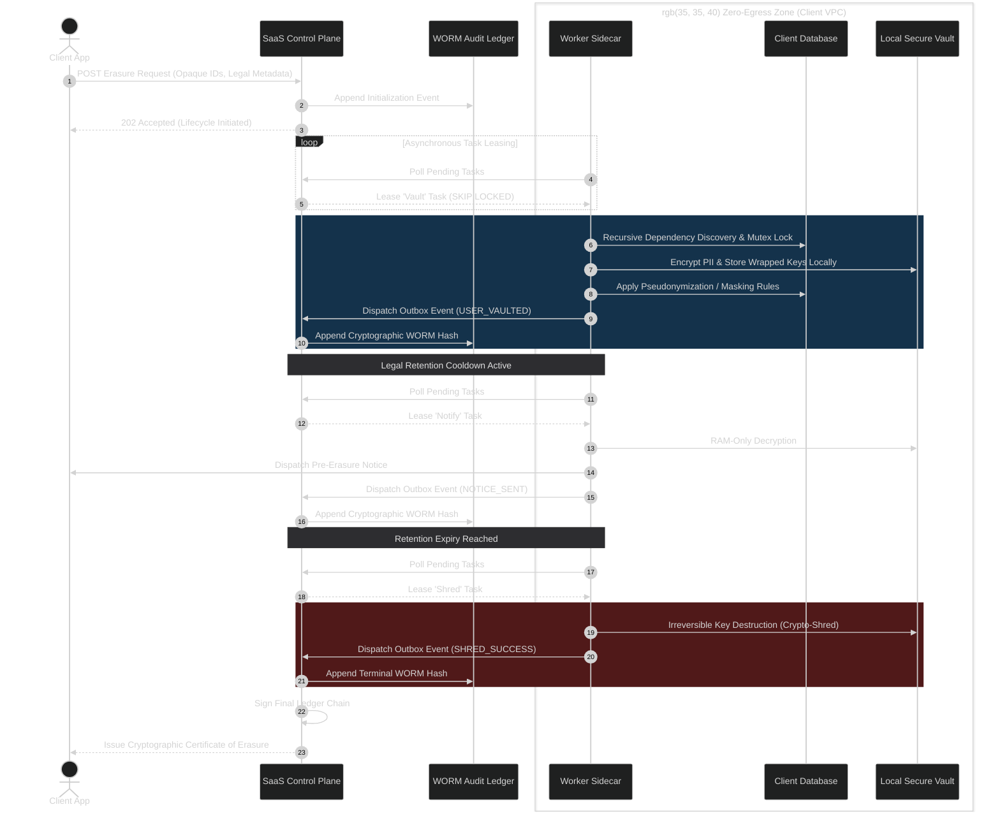

```mermaid
%%{
  init: {
    'theme': 'dark',
    'themeVariables': {
      'background': '#1A1A1B',
      'primaryTextColor': '#E0E0E0',
      'lineColor': '#4CAF50',
      'noteBkgColor': '#2D2D30',
      'noteTextColor': '#E0E0E0'
    }
  }
}%%
sequenceDiagram
    autonumber
    actor Client as Client App
    participant API as SaaS Control Plane
    participant Ledger as WORM Audit Ledger
    
    box rgb(35, 35, 40) Zero-Egress Zone (Client VPC)
        participant Worker as Worker Sidecar
        participant LocalDB as Client Database
        participant Vault as Local Secure Vault
    end

    %% Phase 1: Ingestion
    Client->>API: POST Erasure Request (Opaque IDs, Legal Metadata)
    API->>Ledger: Append Initialization Event
    API-->>Client: 202 Accepted (Lifecycle Initiated)

    %% Phase 2: Atomic Discovery & Vaulting
    loop Asynchronous Task Leasing
        Worker->>API: Poll Pending Tasks
        API-->>Worker: Lease 'Vault' Task (SKIP LOCKED)
    end

    rect rgb(20, 50, 75)
        Worker->>LocalDB: Recursive Dependency Discovery & Mutex Lock
        Worker->>Vault: Encrypt PII & Store Wrapped Keys Locally
        Worker->>LocalDB: Apply Pseudonymization / Masking Rules
        Worker->>API: Dispatch Outbox Event (USER_VAULTED)
        API->>Ledger: Append Cryptographic WORM Hash
    end

    %% Phase 3: Legal Retention
    Note over API,Worker: Legal Retention Cooldown Active
    
    Worker->>API: Poll Pending Tasks
    API-->>Worker: Lease 'Notify' Task
    Worker->>Vault: RAM-Only Decryption
    Worker->>Client: Dispatch Pre-Erasure Notice
    Worker->>API: Dispatch Outbox Event (NOTICE_SENT)
    API->>Ledger: Append Cryptographic WORM Hash

    %% Phase 4: Irreversible Shredding
    Note over API,Worker: Retention Expiry Reached
    
    Worker->>API: Poll Pending Tasks
    API-->>Worker: Lease 'Shred' Task
    
    rect rgb(80, 25, 25)
        Worker->>Vault: Irreversible Key Destruction (Crypto-Shred)
        Worker->>API: Dispatch Outbox Event (SHRED_SUCCESS)
        API->>Ledger: Append Terminal WORM Hash
    end

    %% Phase 5: Certification
    API->>API: Sign Final Ledger Chain 
    API-->>Client: Issue Cryptographic Certificate of Erasure
```
